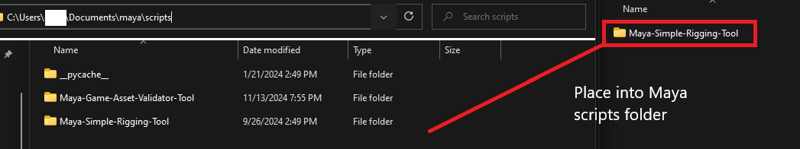

# Overview

A generic game asset validator for Maya. 

Tag assets as part of Prop, Animation, and Character groups. Validate for common asset requirements (detailed below).

Metadata modules provided courtesy of Micah Zahm

**Character Validation Checks**
  - Character Mesh only using valid list of materials
  - Character Mesh Hierarchy only consists of mesh shape objects
  - Character Mesh rigged with skin binding influence only coming from tagged rig joints
  - Rig Hierarchy consists of only joint objects
  - Rig Hierarchy consists of no keyed frames in specified timeframe

**Animation Validation Checks**
  - Rig Hierarchy consists of only joint objects
  - Rig keyed for specified transform attributes, no floating point keys, in specified timeframe

**Prop Validation Checks**
  - Mesh only using valid list of materials
  - Mesh Hierarchy only consists of mesh shape objects
  - Mesh Node connections to prop has no rig influence
  - Mesh has no keyed attributes in specified timeframe
  - Collision Meshes are present, searching with user defined prefix

# Setup

1. Place 'Maya-Simple-Rigging-Tool' folder into Maya scripts directory.

Default Maya script directory is at **C:\Users\\[Username]\\Documents\maya\scripts**

2. Open Maya script editor

3. Edit filepath in following code block, then paste into a **Python** script editor

'''

    import sys
    
    
    # rename [User directory name] to user account Maya files is installed under
    sys.path.append('/Users/[User directory name]/Documents/maya/scripts/Maya-Game-Asset-Validator-Tool/Metadata')
    sys.path.append('/Users/[User directory name]/Documents/maya/scripts/Maya-Game-Asset-Validator-Tool/QtInterface')
    sys.path.append('/Users/[User directory name]/Documents/maya/scripts/Maya-Game-Asset-Validator-Tool/Validator')
    
    import validator_commands
    
    # Change 'run()' to 'validate()' to run validation without changing settings
    # Change to 'assets()' to open the asset window
    # Change to 'validate_json()' to run validation using settings from json file
    validator_commands.run()

'''

4. Create a Toolbar Button for ease of use by middle-click dragging script text

